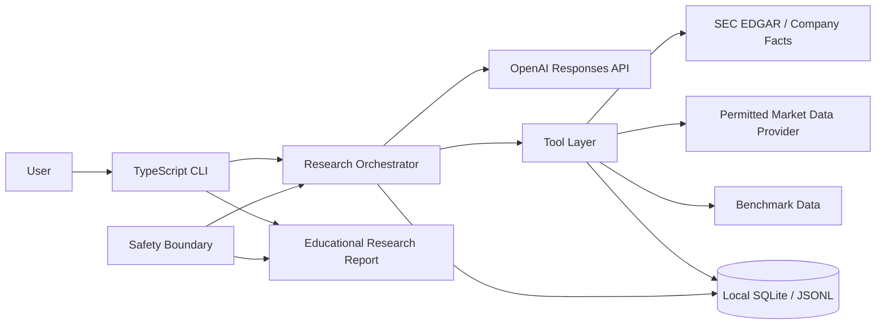
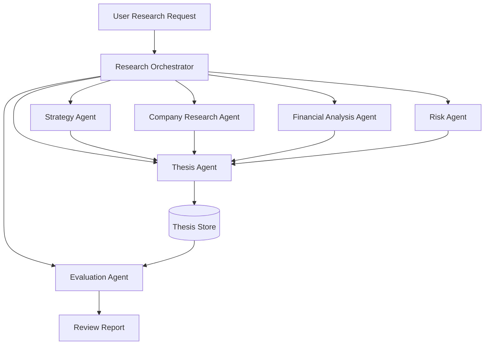
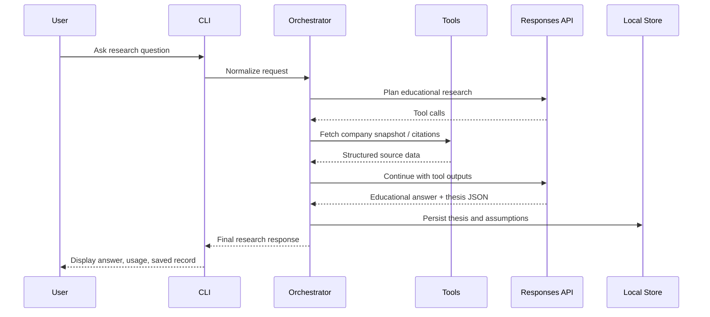
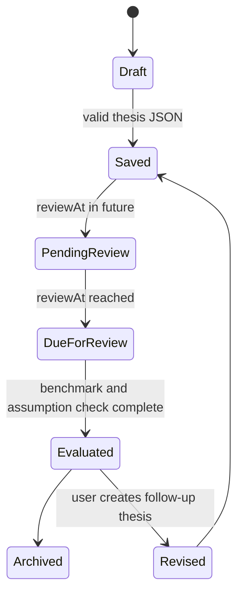
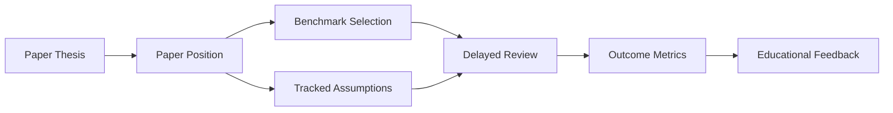
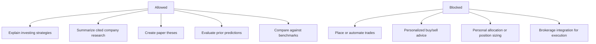
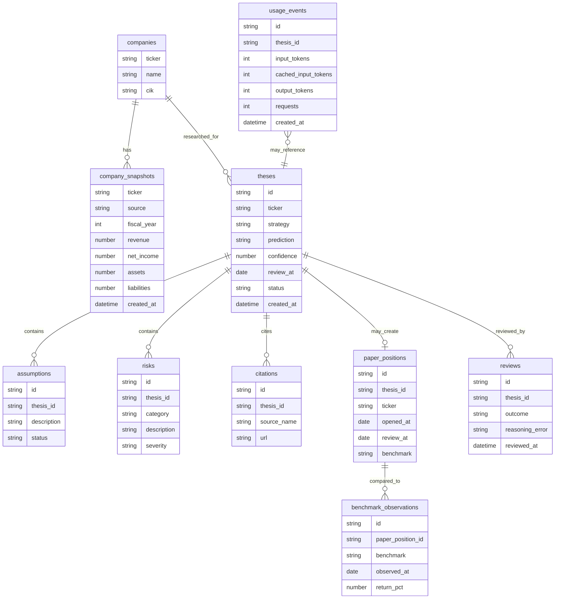

# Personal Investing Agent Architecture

This project is an educational, paper-trading-only stock research agent. It teaches investing strategies, researches companies from permitted sources, drafts paper-investment theses, tracks assumptions, and reviews predictions after a defined period.

It must not execute trades, automate brokerage actions, or give personalized buy/sell advice.

## Design Principles

- Keep facts, assumptions, interpretations, and paper theses visibly separate.
- Prefer cited, permitted, reproducible data sources over unsupported claims.
- Treat every thesis as educational paper research, not a recommendation.
- Store enough context to review whether the reasoning was useful later.
- Make mock mode first-class so the workflow can be tested without API spend or data-provider access.
- Add complexity in phases: reliable thesis records before portfolio analytics, analytics before automation.

## System Context



## Agent Architecture



## Request Flow



## Thesis Lifecycle



## Paper Portfolio Workflow



## Safety Boundary



## Data Model



## Source Policy

Initial permitted sources:

- SEC Company Facts API for historical XBRL fundamentals.
- SEC EDGAR filing URLs for citations.
- Mock fixtures for deterministic local development.

Future permitted sources should be added only when their license, rate limits, and citation requirements are understood. Price, benchmark, and news providers should be isolated behind provider interfaces so the rest of the agent does not depend on a single vendor.

## Core Contracts

### Company Snapshot

```ts
type CompanySnapshot = {
  ticker: string;
  companyName: string;
  cik: string;
  fiscalYear?: number;
  revenue?: number;
  netIncome?: number;
  assets?: number;
  liabilities?: number;
  source: string;
  limitations: string[];
};
```

### Paper Thesis

```ts
type Thesis = {
  ticker: string;
  company: string;
  strategy: string;
  prediction: string;
  confidence: number;
  assumptions: string[];
  invalidationConditions: string[];
  reviewAt: string;
  citations: string[];
};
```

## Phase-Wise Implementation Plan

### Phase 0: Architecture And Contracts

Deliverables:

- Architecture document with diagrams.
- Source policy and safety boundary.
- Typed contracts for snapshots, theses, assumptions, usage, and reviews.
- Clear CLI behavior for mock and live modes.

Exit criteria:

- The implementation plan is visible in the repo.
- Future code changes have a stable target design.

### Phase 1: Core Agent Loop

Deliverables:

- Responses API loop with typed tool calls.
- Six-turn limit.
- Usage tracking for input, cached input, output tokens, and request count.
- `prompt_cache_key`.
- Mock mode without API key.
- Structured thesis JSON in the final response.

Exit criteria:

- `npm run build` passes.
- `npm run dev` works without an API key.
- A structured paper thesis can be parsed locally.

### Phase 2: Real Company Data

Deliverables:

- SEC Company Facts adapter.
- Ticker-to-CIK lookup.
- Source limitations surfaced to the model.
- Provider interface for future data sources.
- Offline fixture mode with `USE_MOCK_DATA=1`.

Exit criteria:

- Company snapshot tool returns cited SEC-derived data in live mode.
- Mock mode remains deterministic.
- Tool failures produce educational, non-trading-safe errors.

### Phase 3: Persistence

Deliverables:

- SQLite schema and migrations.
- Thesis persistence.
- Assumption, citation, usage, and review tables.
- CLI commands:
  - `research`
  - `list-theses`
  - `show-thesis`
  - `review-due`

Exit criteria:

- A thesis survives across runs.
- Review dates can be queried.
- Usage can be associated with a thesis.

### Phase 4: Specialist Subagents

Deliverables:

- Strategy agent for educational frameworks.
- Company research agent for business model and filing context.
- Financial agent for ratios and historical trends.
- Risk agent for downside and invalidation checks.
- Thesis agent for structured output.

Exit criteria:

- The orchestrator can request specialist work selectively.
- Each specialist returns structured output.
- The final thesis cites which specialist claims informed it.

### Phase 5: Paper Portfolio

Deliverables:

- Paper position records linked to theses.
- Benchmark selection.
- Opening snapshot.
- Watchlist and pending review status.

Exit criteria:

- A thesis can create a paper position.
- No brokerage or trading execution exists.
- Paper positions are clearly labeled educational.

### Phase 6: Delayed Evaluation

Deliverables:

- Review worker or CLI command.
- Benchmark comparison.
- Assumption status update.
- Outcome classification.
- Reasoning error labels.

Exit criteria:

- Due theses can be reviewed after `reviewAt`.
- Prediction quality can be compared against a benchmark.
- The agent produces an educational post-review explanation.

### Phase 7: Budgets, Citations, And Metrics

Deliverables:

- Per-run cost and token budgets.
- Citation coverage checks.
- Confidence calibration metrics.
- Benchmark-relative performance metrics.
- Reportable evaluation summaries.

Exit criteria:

- The agent can stop before exceeding a budget.
- Reports show source coverage and prediction quality.
- Reviews identify whether confidence was calibrated.

### Phase 8: Reporting And UX

Deliverables:

- Thesis report.
- Risk register.
- Assumption tracker.
- Paper portfolio dashboard.
- Review history.
- Exportable Markdown or JSON summaries.

Exit criteria:

- A user can inspect what the agent believed, why it believed it, what happened, and what to learn next.

## Suggested Build Order

1. Keep the current CLI and agent loop simple.
2. Extract source adapters into modules.
3. Add SQLite before adding more agent complexity.
4. Add specialist agents after persistence can store their outputs.
5. Add paper positions only after thesis review data exists.
6. Add delayed evaluation once benchmark data is available.
7. Add reporting last, when the data model has stabilized.
